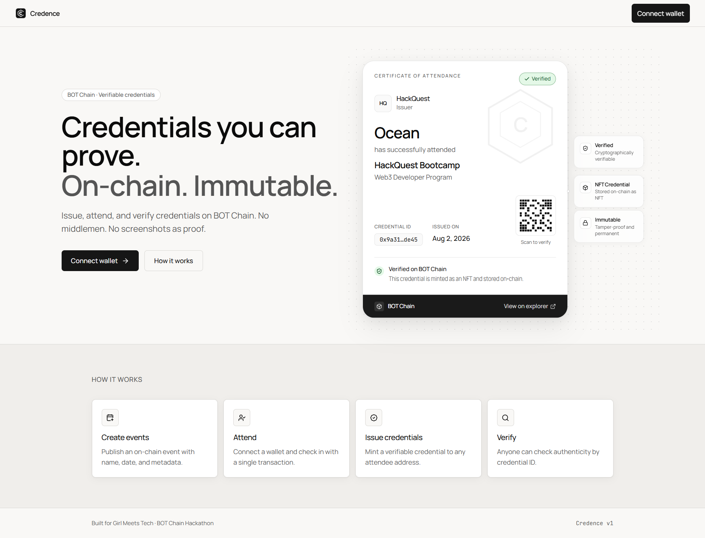

<div align="center">


# Credence

**Verifiable Credential Issuance Platform on BOT Chain**

Issue, store, and verify digital credentials on-chain — immutable, portable, and trustless.

<br />

[](https://scan.botchain.ai/)
[](https://soliditylang.org/)
[](https://reactjs.org/)
[](https://vitejs.dev/)

<br />



<br />

[Live Demo](#live-demo) · [Features](#features) · [How It Works](#how-it-works) · [Smart Contract](#smart-contract)

</div>

---

## Problem

Digital certificates are easy to fake, hard to verify, and scattered across PDFs, emails, and Google Drive. Organisers handle manual verification requests. There is no standard digital identity to store all achievements in one place.

## Solution

**Credence** is a blockchain-based platform for issuing **Verifiable Credentials**. Organisations publish credentials on-chain (BOT Chain). Anyone can verify authenticity without a third party — no screenshots, no manual checks.

## Vision

Become the trusted infrastructure for digital credentials.

---

## Features

| | Feature | Description |
|:---:|---------|-------------|
| 📅 | **Create Events** | Organisers publish on-chain events (gas-optimized storage). |
| ✅ | **Attend / Check-in** | Participants check in on-chain (single status write — low gas). |
| 🏅 | **Issue Credentials** | Organiser mints **only if** the recipient already attended. |
| 🔍 | **Verify** | Anyone checks credential validity by ID (read-only, free). |
| 📋 | **Event List** | Browse all events with status. |

---

## How It Works

<div align="center">

```
Organiser ──create event──► BOT Chain
Participant ──attend──► status = attended
Organiser ──issue (only if attended)──► credential
Anyone ──verify──► authenticity without third party
```

</div>

### Gas model (optimized contract)

| Action | Who pays | Design |
|--------|----------|--------|
| Create event | Organiser | Packed struct, custom errors, lean events |
| Attend | Participant | One `uint8` status SSTORE (no arrays) |
| Issue credential | Organiser | Requires `attended`; one status upgrade + push |
| Verify | Free | View call |

### 1. Organiser

- Connect wallet (MetaMask)
- Create an event with name, date, and description
- Wait for participants to attend
- Issue credentials only to wallets that attended
- Credentials are minted on-chain — immutable and permanent

### 2. Participant

- Connect wallet
- Browse events
- Click **Attend** → confirm the (low-gas) check-in tx
- Share your wallet address with the organiser
- Receive a credential after the organiser issues it

### 3. Verifier

- Open the verification page
- Enter credential ID or wallet address
- See credential status, issuer, event, issue date, and transaction hash

---

## Tech Stack

| Layer | Stack |
|-------|--------|
| **Smart Contract** | Solidity `^0.8.20` · BOT Chain (EVM) |
| **Frontend** | React 18 · Vite · Tailwind CSS |
| **Wallet** | ethers.js · wagmi (RainbowKit ready) |
| **Network** | BOT Chain — Testnet `968` · Mainnet `677` |
| **Hosting** | GitHub Pages + custom domain |

---

## Live Demo

<div align="center">

**[🔗 Open Credence](https://gmt-credence.vercel.app/)**

</div>

---

## Smart Contract

| Network | Address |
|---------|---------|
| **Testnet** | [`0x3AaA20E9c56E7675e01cbad06359ceaEF429b5E7`](https://scan.bohr.life/address/0x3AaA20E9c56E7675e01cbad06359ceaEF429b5E7) |
| **Mainnet** | [`0x360199E70FC97331C6404E9074f1Ff67f1da887A`](https://scan.bohr.life/address/0x360199E70FC97331C6404E9074f1Ff67f1da887A) |

---

## Project Structure

```
gmt-credence/
├── programs/
│   └── Credence.sol      # Smart contract
├── frontend/
│   ├── public/           # Assets & preview
│   └── src/              # React app (Landing, Dashboard)
└── README.md
```

---


<div align="center">

**Credence** — verifiable credentials on BOT Chain
Made for the BOT Chain hackathon

</div>
